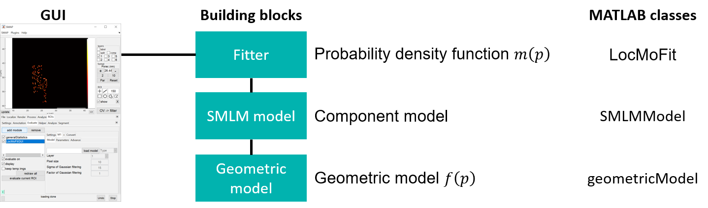

# Structure of LocMoFit

:::{important}
If you would just like to try out LocMoFit, the information provided here is not essential. You can directly start with the tutorial {doc}`/tutorial/quickstart` and consult this page later.
:::

The individual geometry to be fitted to the data is defined in the **geometric model** (see {class}`@geometricModel.geometricModel`). Model-specific parameters should be defined here. The geometric model is then handled by the **SMLM model** (see {class}`@SMLMModel.SMLMModel`), where general parameters (positions, rotations, background ... etc.) are incorporated. Finally, the SMLM model is converted to a probability density function (PDF) by the **fitter** (i.e., {class}`@LocMoFit.LocMoFit`) and fitted to the data. Combining multiple SMLM models in the fitter to form a composite model is possible. The optimizer of choice and its settings should be defined in the fitter. The fitter then fits the PDF to the data.

:::{note}
Most of the time, the user only has to interact with the fitter, either through the SMAP GUI or by calling the MATLAB classes.
:::

## Geometric model
We provide a list of {doc}`pre-defined geometric models</LocMoFit.modelLibrary>`, including the ones used in the [manuscript](https://www.biorxiv.org/content/10.1101/2021.08.30.456756v1), which are ready to use. If none of them suit your purpose, you can {doc}`build your own models</notes/programming.buildModels>`, which require basic programming skills in MATLAB.

### Model type and format
A geometric model can be defined as an image or a sub-class of {class}`@geometricModel.geometricModel`.

* **Image**: _png_ and _mat_ files. A rigid template with only extrinsic parameters.

* **sub-class of geometricModel**: _m_ files.

## SMLM model
This class (and its sub-class) links a geometric model to the fitter and defines how the PDF is calculated. A geometric model has to be 'loaded' to an SMLM model to be controlled. Different model types are handled by different sub-classes:
* **Image**: handled by {class}`@imageModel.imageModel`. The image serves as a density map. The likelihood value of each localization is calculated based on spatial interpolation on the map. Since the map is the same for all localizations, they share the same uncertainty, which is determined by how 'blurred' the image is.
* **sub-class of geometricModel**: handled by {class}`@functionModel.functionModel`. There are two different ways of calculating the PDF:
	* **Continuous**: a model with both intrinsic and extrinsic parameters. During the optimization, a continuous model generates a density map and the likelihood value of each localization is calculated based on spatial interpolation on the map. Since the map is the same for all localizations, they share the same uncertainty (usually it is the mean value).
	* **Discrete**: a model with both intrinsic and extrinsic parameters. During the optimization, a discrete model generates a set of model points and the likelihood value of each localization is calculated based on its distance to each model point. The real uncertainty of each localization is used.

## Fitter
The fitter (implemented as the class {class}`@LocMoFit.LocMoFit`) controls and combines (if multiple SMLM models are loaded) geometries into a single PDF which is then fitted to localization data. The fitting is done by _maximum likelihood estimation_, i.e., varying the free structural  parameters in order to maximize the log-likelihood, the matrice indicating a good fit. This procedure, termed optimization, is achieved by a specific optimizer (see below). After the fit, [parameter estimates are then reported](/basics/GUIOverview.html#tab-fitted-par) and the [fit results are visualized](/basics/GUIOverview.html#fit-viewer).

Initial values of the structural parameters and their boundaries should be defined here. The optimizer of choice and its settings should also be defined here.

### Optimizers
Currently, LocMoFit supports three different optimizers:
* **fmincon**: a nonlinear optimizer provided by MathWorks. This optimizer is a gradient-based method.
* **fminsearchbnd**: a derivative-free optimizer implemented by John D'Errico, based on the fminsearch optimizer by MathWorks.
* **particleswarm**: an optimizer that searches the parameters more globally. Also provided by MathWorks.