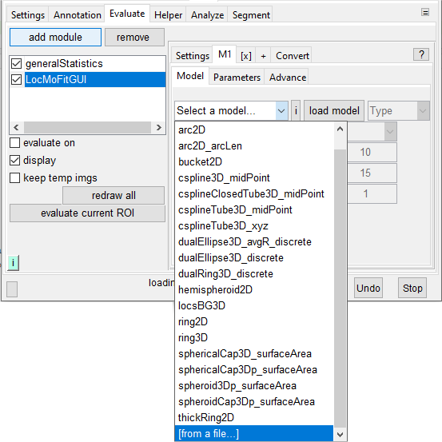

# Load a model in LocMoFit GUI

## Built-in models
1. Go to a model tab (**[M1]** or **[M2]**... etc.) -> **[Model]**.
2. Click the drop-down menu (where _selet the model..._ is shown).
3. Select the model to be loaded, and then click **load model**. The possible options of models are documented in the {doc}`page of model library <../LocMoFit.modelLibrary>`.

## Own models
1. Go to a model tab (**[M1]** or **[M2]**... etc.) -> **[Model]**.
2. Click the drop-down menu (where _selet the model..._ is shown).
3. Select the option _[from a file...]_ at the bottom, and then click **load model**. Navigate to where the model you want to load is and load the model.
	:::{note}
	**Possible formates of a model** include .png and .mat for images and .m for functions.
	:::{warning}
	Loading .m files is not supported by the compiled version of SMAP.
	:::