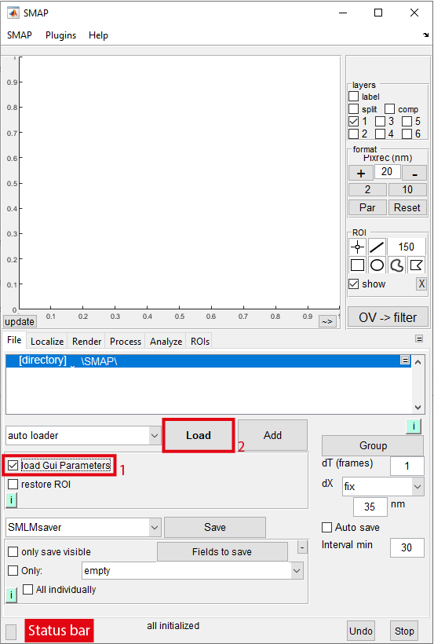
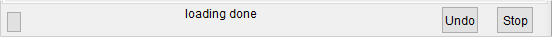

# Data loading in SMAP

1. Check _load Gui Parameters_.

	:::{note}
	With this, the previously saved Gui Parameters in the file will be also loaded and applied. Otherwise the SMAP session keeps the original parameters.
	:::

2. Click **load**, navigate to where the localization data are saved, and select the files to be loaded. Wait until _loading done_ is displayed in the status bar:

	

Now the file(s) is loaded.