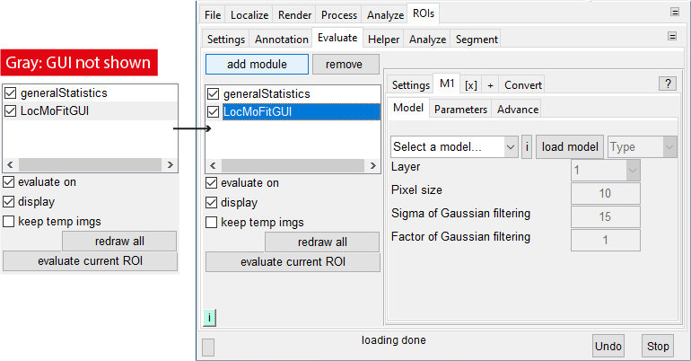

# Load LocMoFit GUI in SMAP
1. Go to the **[ROIs]** tab.
2. Go to **[Evaluate]** tab and click **add module**.

   
3. In the popup window, select _LocMoFitGUI_ and click *ok*.
4. Show the _LocMoFitGUI_ GUI by clicking on it in the list of loaded modules.   
Your SMAP window should look like this now:

   