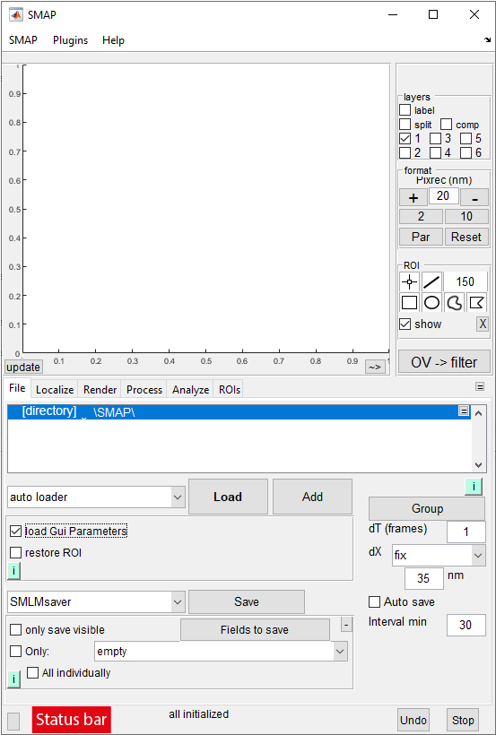

# Run SMAP

## In MATLAB
Simply enter _SMAP_ in the _MATLAB Command Window_:
:::matlab
SMAP
:::

## Compiled version
You can run SMAP through the _SMAP_ shortcut in the operating system's start menu.

If you successfully open SMAP, you should see its main GUI with _all initialized_ displayed in the **status bar**:

