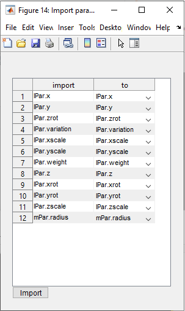
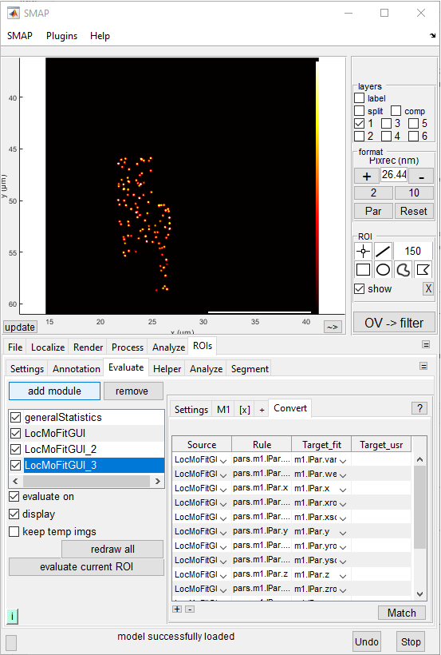
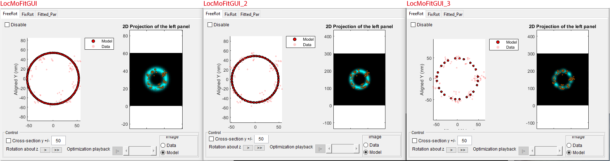
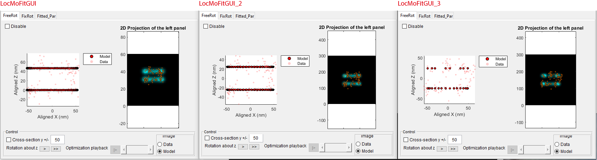
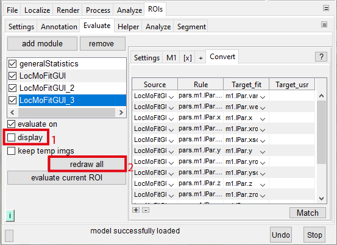
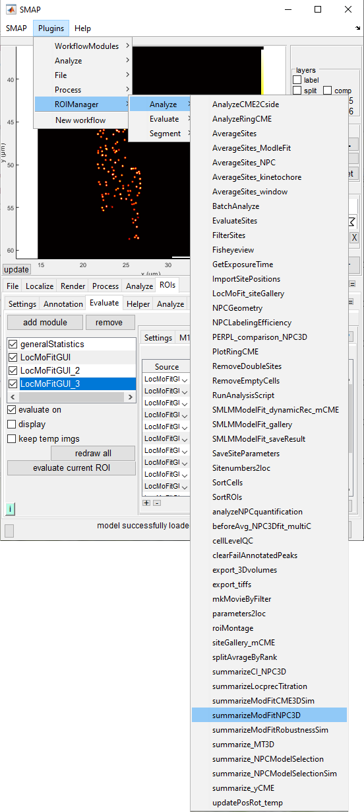
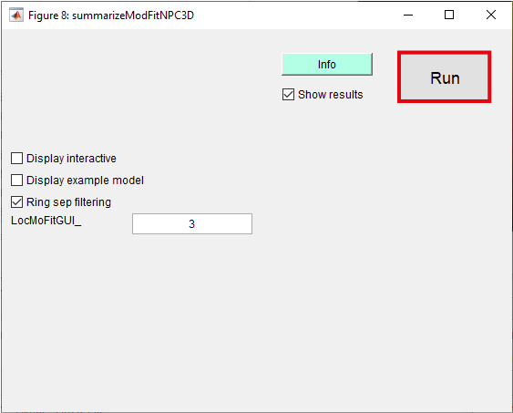
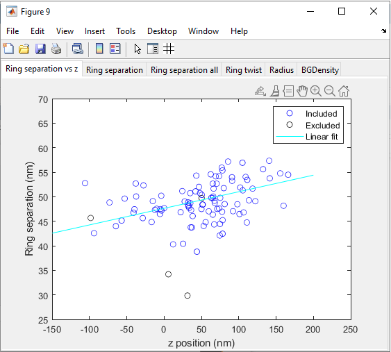

# Chaining steps

:::{note}
Time required: ~20 min.
:::

:::{note}
In this tutorial, we loaded the pre-defined parameter settings to simplify the procedure. For all the structures we fit in our manuscript, we provide optimized settings. However, when you work on a new structure, you have to tweak the settings yourself and modify the **parameter table** (find out more {doc}`here<../basics/parTable>`).
:::
	
## Task
Chaining fitting steps with the GUI. We will set up two fitting steps with different models, using the results of the previous step as the initial parameters for the next one.

## Requirement
* Software: **SMAP** installed. Further information can be found on our [GitHub](https://github.com/jries/SMAP/) site.
* Localization data: _U2OS_Nup96_BG-AF647_demo_sml.mat_
* Fitting settings:
	* _NPC3D_step1_dualRings_LocMoFit.mat_ (the one you saved in the last [tutorial](./compositeModel#Saving_all_settings))
	* _NPC3D_step2_dualRings_freeRadius_LocMoFit.mat_
	* _NPC3D_step3_points_LocMoFit.mat_

Files can be downloaded [here](https://www.embl.de/download/ries/LocMoFit/).

:::{important}
Please first finish the tutorial {doc}`composite model<./compositeModel>`.
:::

## Main tutorial

### Preparation
1. Start SMAP ({doc}`how to? <../howto/SMAP.runSMAP>`).
	:::{important}
	If you continue from the previous tutorial, please close the current SMAP and start a new session.
	:::
2. Load the dataset _U2OS_Nup96_BG-AF647_demo_sml.mat_.
3. Load an instance of the plugin **LocMoFitGUI** (see {doc}`quick start<../tutorial/quickstart>` if you forget how to do it).

### Loading LocMoFit
Now you need two instances of LocMoFit:
* Go to **[Evaluate]** tab and click on **add module**.
* In the popup window, select _LocMoFitGUI_ and click **ok**.
* Repeat the two steps above twice more.

Now you should see the **LocMoFitGUI**, **LocMoFitGUI_2**, and **LocMoFitGUI_3** in the loaded modules. These are for three different fitting steps respectively.

### Setup
Next, we load the LocMoFit settings for fitting three different models (step 1: {class}`ring3D<models.ring3D>`; step 2: {class}`dualRing3D_discrete<models.dualRing3D_discrete>`; step 3: also {class}`dualRing3D_discrete<models.dualRing3D_discrete>` but with only 32 points).
* Step 1 fits the composite dual-ring model (template) you built earlier to detect the ring separation, position, and orientation of the NPC.
* Step 2 fits a single dual-ring model with a free radius to detect it and to fine-tune other parameters.
* Step 3 fits a point model to detect the ring twist.
To set them up, follow the steps below:
1. For step 1, click *LocMoFitGUI* in the list of loaded modules.
2. On the right panel, go to **[Settings]**, click **load**, navigate to the settings directory, and select _NPC3D_step1_dualRings_LocMoFit.mat_ (which you saved earlier).
3. For step 2, click *LocMoFitGUI_2* in the list of loaded modules.
4. On the right panel, go to **[Settings]**, click **load**, navigate to the settings directory, and select _NPC3D_step2_dualRings_freeRadius_LocMoFit.mat_.
5. For step 3, click *LocMoFitGUI_3* in the list of loaded modules.
6. On the right panel, go to **[Settings]**, click **load**, navigate to the settings directory, and select _NPC3D_step3_points_LocMoFit.mat_.
7. Go to tab **[Convert]**, click **Match**. You should see a new window:

	

:::{note}
What is this popup window for? It allows you to pass the parameter estimations from the previous steps to the current step as initial parameters based on the names of parameters.
:::

8. In the popup window, select LocMoFitGUI_2 in **Source LocMoFitGUI_** and the click **Apply**. Now you should see new information filled in tab **[Convert]**:

	
	
	:::{note}
	**[Convert]** can be used to convert the fitted values in the previous step to a initial parameter of the current step. It calculates values according to the **rules** based on its **source** and then writes the values to the **target_fit** (see the column names of the convert table). For example, you just defined to assign the parameter m1.mPar.ringDistance in this step from the **Source** _LocMoFitGUI_ based on the value calculated by the **Rule** pars.m2.lPar.z.

	_m1.mPar.ringDistance_ and _pars.m2.lPar.z_ are IDs of the corresponding parameters. m1.mPar.ringDistance means the parameter _ringDistance_, which is a intrinsic parameter (_mPar_) of model 1 (_m1_). See the syntax that can be used in **[convert]**.
	:::

### Fitting
1. Click on site 1 in the _ROI manager_ window. Now you should see three viewers, one for each step:

	* X-Y view
	
	
	
	* X-Z view
	
	

2. You can further explore a few sites to get familiar with the interface.

### Batch fitting
After inspecting several sites, we are now moving on to fit all sites. Such a batch analysis can be executed with the _redraw all_ function to perform the fitting site-by-site:
1. To disable the viewers for efficiency, stay in the **[Evaluate]** tab. In the left panel, uncheck **display**:

	
	
2. Click **redraw all** as shown above. You will see the analysis going down the ROI list.
	:::{Note}
	* While running, you should see the message _"redrawall: site [current site] of 100"_ in the status bar.
	* You will know the analysis is done when _"redrawall: completed"_ shows up in the status bar. This usually takes around 7 minutes.
	:::

### Summary of parameter values
When the **redraw all** is done, all the fit results have been saved in the SMAP session.
To show the summary of parameter values, you can use the SMAP plugin _summarizeModFitNPC3D_:
1. Go to the drop-down menu **[Plugins]** -> **[ROIManager]** -> **[Analyze]** -> **[_summarizeModFitNPC3D_]**:
	
	
	
2. Click **Run** in the new window:

	

	The window where a scatter plot and histograms will then pop up:
	
	
	
	The tabs are:
	* **Ring separation vs z**: a scatter plot showing the correlation between the z position and ring separation of the NPCs.
	* **Ring separation**: a histogram of the ring separation (one-ring sites excluded).
	* **Ring separation all**: a histogram of the ring separation (all sites).
	* **Ring twist**: a histogram of the ring twist (one-ring sites excluded).
	* **Radius**: a histogram of the radius (one-ring sites excluded).
	* **BGDensity**: a histogram of the background density (one-ring sites excluded).

Now you have reproduced the workflow we applied in the manuscript to extract key structural parameters of single NPCs!

### The end of the introductory series
This tutorial is the end of the introductory series. If you started from {doc}`quick start<./quickstart>` and followed along the _Next tutorial_ section in each tutorial, you should have learned the basics of LocMoFit.