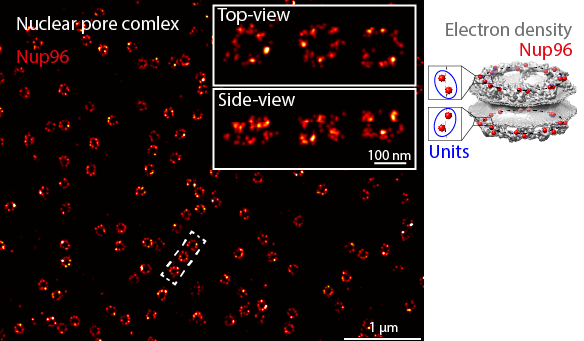

Introductory series
===================
This series is designed for a beginner  user to get an overview of LocMoFit GUI. You will learn how to define the setting steps in order to extract structural parameters by fitting geometric models.

Here, the nuclear pore complex (NPC) will be used as the example structure. After the tutorials, you should be able to reproduce the workflow we applied to extract structural parameters of individual NPCs (see Fig. 2a-f in our `manuscript describing LocMoFit <https://www.biorxiv.org/content/10.1101/2021.08.30.456756v1>`_).

The individual NPCs appear as rings if you see them in their top views. In its side view, an NPC appears as two parallel rings. In the example dataset we will be using, we genetically labeled Nup96, a protein that has 32 copies per NPC. Two copies form a unit that appears eight times in one ring. Therefore, the rings look discontinuous. Also, because the labeling efficiency is not 100% (some of the protein copies are not visible in the images), some rings look incomplete.

We are particularly interested in the radius, ring separation, and ring twist, the three key structural parameters of the NPC.
In this series, we will show you how to extract these parameters using LocMoFit step-by-step.

Tutorials
------------
* In **Quick start**, you will perform a simple fit: fitting top-view projections of the NPCs with a ring model. This helps you to get familiar with the LocMoFit GUI.
* In **Composite model**, you will extend the fit to 3D and extract the ring separation based on a dual-ring model you will build yourself.
* In **Chain steps**, you will learn how to extract the three parameters robustly by chaining different fitting steps: transitioning from a smooth dual-ring model to a detailed eight-fold rotationally symmetrical model.

.. note::
Time required: 45 min - 1 hr for all tutorials.

.. toctree::
   :maxdepth: 1
   
   ../tutorial/quickstart.md
   Composite model <../tutorial/compositeModel.md>
   ../tutorial/chainSteps.md
   
