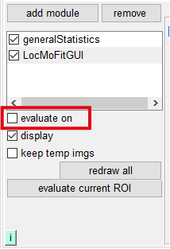
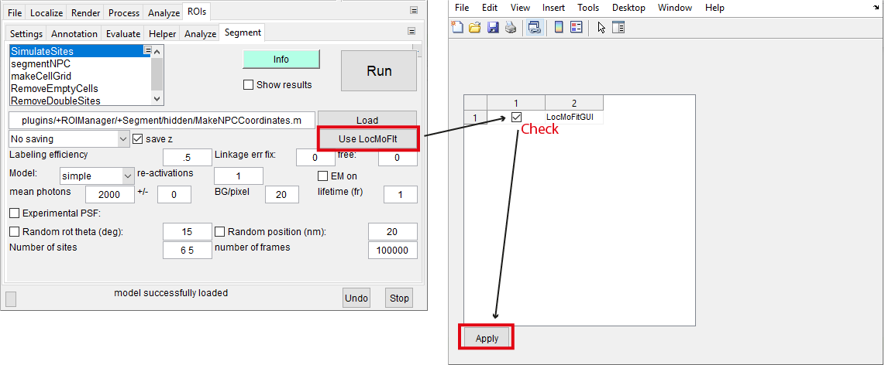
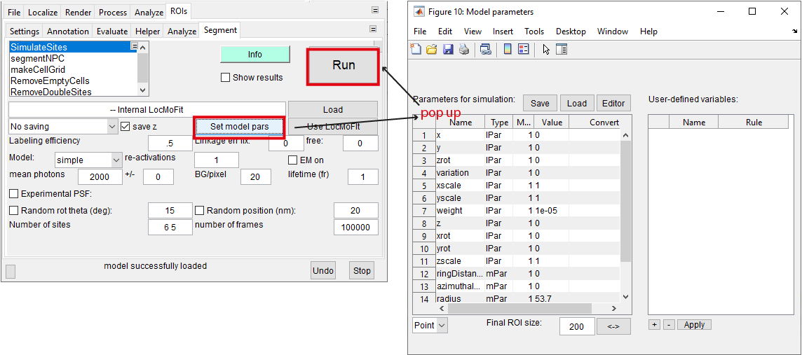
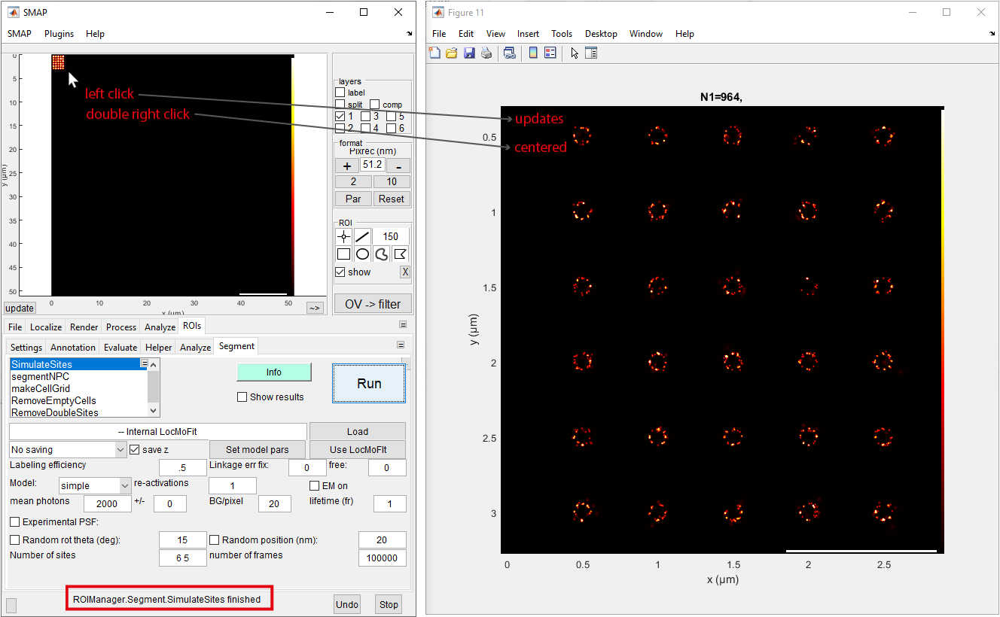
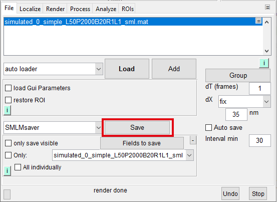

# Simulating SMLM data

:::{note}
Time required: ~10 min.
:::
In this tutorial, you will learn how to simulate SMLM data based on a geometric model.

## Requirement
* Software: SMAP installed. Further information can be found on our [GitHub](https://github.com/jries/SMAP/) site.

## Task
Simulating realistic localization data based on a geometric model.

## Main tutorial

### Preparation
You have to load the geometric model for generating localizations. We use LocMoFitGUI as the interface for setting up the model. Here we use the point model {class}`dualRing3D_discrete<models.dualRing3D_discrete>` of the nuclear pore complex as an example:
1. Start SMAP ({doc}`how to? <../howto/SMAP.runSMAP>`).
2. Load a new instance of the module *LocMoFitGUI* in tab **[ROIs]** -> **[Evaluate]** (see {doc}`quick start<../tutorial/quickstart>` to recap).
3. Uncheck **evaluate on** in the left panel:
	
	
	
4. Load the particular model and set up the settings for the model parameters:
	* Go to **[M1]** -> **[Model]**, click the drop-down menu (where _select the model..._ is shown), and then select _{class}`dualRing3D_discrete<models.dualRing3D_discrete>`_.

### Simulation
Once the model is loaded, we have to pass it on to the simulation engine provided by SMAP:

1. We first connect the engine to the model:
	* Go to [ROIs]->[Segment], click *SimulateSites* in the list of plugin:
	* Click **Use LocMoFit** and check _LocMoFitGUI_ in the new window.
	* Click **Apply**.
	
	LocMoFitGUI is successfully loaded if the new button **Set model pars** shows up.
	
2. Click **Set model pars**. A new window will show up and allow you to specify parameter values. Here we keep the default values so do not have to change anything:

	

	:::{note}
	**How do I specify parameter values?**
	* **For specifying a fixed value**, enter it in field **Value** for a parameter (can be identified in the columns *Name*, *Type*, and *Model*).
	* **For a random value sampled in a defined interval**, enter two values (e.g., *'-15 15'*) separated by a space in field **Value**. In this example, the parameter will be a random value between -15 and 15.

3. Usually, we have to set up the SMLM properties in tab **[SimulateSites]**. For simplicity, we keep the default values.
	:::{hint}
	You can hover over the respective properties in the tab to show their definitions.
	:::
	
4. Click **Run** in **[SimulateSites]**. The simulation is done when *'ROIManager.Segment.SimulateSites finished'* is displayed in the status bar. This usually takes a few seconds:

	
	
Now you can explore the overview of the simulated data. You can interact with the overview with a left click or double right click. You can deal with the simulated data as with real data.

:::{note}
**How do I keep the simulated data?** You can save it through button **Save** in tab **[File]**:

:::

This is the end of the tutorial.